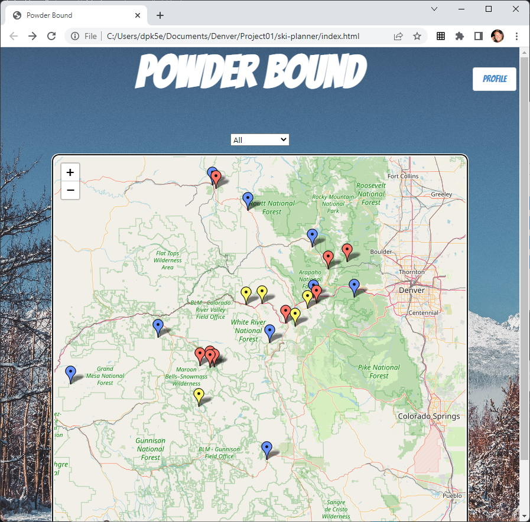
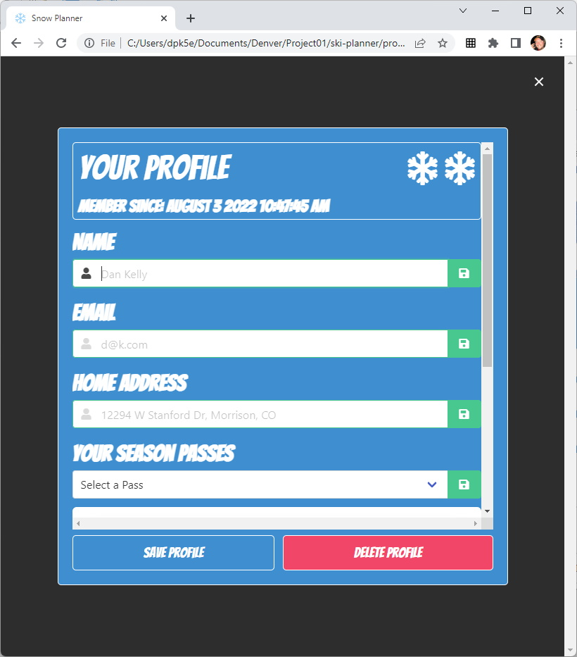

# Powder Bound

## Index

1. [Overview](#overview)
2. [Features](#features)
3. [Future Enhancements](#future-enhancements)
4. [Acceptance Criteria](#acceptance-criteria)
5. [Website Preview](#website-preview)
6. [Technologies](#technologies)
7. [Collaborators](#collaborators)
8. [Resources](#resources)

## Overview

### Description

When you're searching for powder, the last thing an avid skier or boarder wants to do is open up tons of different website searching for the best place to ski with the least travel issues. In the past, you'd have to go to Google Maps for Driving Directions, your favorite weather website for weather info, and each individual resort's website for snow condition. Not cool Bro. Well, the Powder Bound app puts all this information into one convenient location allowing you to plan your stoke with ease. Powder Bound allows you to select your favorite Colorado ski destination to quickly see snow conditions, driving directions, and weather forecast information. It's everything you need to hit the slopes, strap in, and shred the gnar when it's dumping!

### User Story

```
As an active skier in Colorado, I want to plan my ski adventures using critical information
about the travel process such as weather, driving directions, snow conditions, and more.
```

## Features

1. Interactive Map of Colorado Ski Areas synced with the user's ski pass and favorite resorts.
2. Dashboard view of critical travel information including weather, driving directions, snow conditions.
3. User Profile Page including preferred driving start address, ski passes, etc.
4. Reads daily updates from the US Department of Agriculture's [Snow Telemetry (SNOTEL) Network](https://www.nrcs.usda.gov/wps/portal/wcc/home/aboutUs/monitoringPrograms/automatedSnowMonitoring/)

## Future Enhancements

1. Sync the weather with driving directions so the user knows what the weather is forecasted to be when they get to various waypoints on their route.
2. Display all SNOTEL stations in Colorado on the map to provide info for backcountry skiers.
3. Add travel alerts to the driving directions display.
4. Use secure authentication and server side storage for user profiles
5. Increase robustness of input validation
6. Refactor code to single purpose functions

## Acceptance Criteria

```
GIVEN I'm a frequent skier I want an easy way to plan my trip

WHEN I go to my planner
THEN I am presenteed with map that displays the resorts in Colorado

WHEN I click on a resort
THEN I am presented with resort weather condition base depth, 24 hour totals, forecast

WHEN I click on resort
THEN I am presented with button to obtain get step by travel directions
THEN I am presented with step by step travel directions at checkpoints with weather

WHEN I want to see snow total by resort
THEN I can view a summary

WHEN I want to set my profile
THEN I click on the profile button (in the upper right corner)

WHEN I go to my profile
THEN I can set my preferred started location, my preferred mountains, preferred ski pass

```

## Website Preview

### Static Screenshots





<!-- ### Video Preview

 -->

## Technologies

1. HTML
2. CSS
3. JavaScript
4. GitHub (website hosting and source code management)
5. [Moment.js v2.27.0](https://momentjs.com/)
6. [jQuery v3.6.0](https://jquery.com/)
7. [Bulma v0.9.4](https://bulma.io/)
8. [Leaflet v1.8.0](https://leafletjs.com/)

### 3rd Party Application Programming Interfaces

1. [Open Weather](https://openweathermap.org/api/one-call-3)
2. [Powderlin.es - SNOTEL DATA](http://powderlin.es/api.html) - Special thanks to Bobby Marko for helping us navigate the CORS and mixed content issues with his API.
3. [Google Static Maps](https://developers.google.com/maps/documentation/maps-static/overview)
4. [MapQuest Directions](https://developer.mapquest.com/documentation/directions-api/)
5. [MapQuest GeoCoding & Reverse Geocoding](https://developer.mapquest.com/documentation/geocoding-api/)
6. [MapQuest Static Maps](https://developer.mapquest.com/documentation/static-map-api/v5/)
7. [MapQuest Search Ahead](https://developer.mapquest.com/documentation/searchahead-api/)
8. [Geolocation](https://developer.mozilla.org/en-US/docs/Web/API/Geolocation_API)

### Dependencies

1. [VS Code Live Server](https://ritwickdey.github.io/vscode-live-server/)

## Collaborators

1. Alex Cleveland: [Github LINK](https://github.com/AClevel5/)
2. Dan Kelly: [Github LINK](https://github.com/dpk5e7)
3. Steve Calla: [Github LINK](https://github.com/stevecalla)

## Resources

1. GitHub Repo: <https://github.com/stevecalla/ski-planner>
2. GitHub Hosted URL: <https://stevecalla.github.io/ski-planner/>
