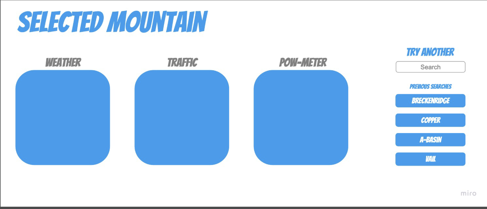

## Overview

```
As an active skier I want to plan my ski adventures using critical information about the travel process such as weather (current location, along the route & at the destination including snow conditions), map my route including travel alerts and more.
```


## Index

<!-- <details><summary></summary> -->

1. [Overview](#overview)
2. [Features](#features)
3. [Future Enhancements](#future-enhancements)
2. [Acceptance Criteria](#acceptance-criteria)
4. [Technologies](#technologies)
6. [Resources](#resources)

## Features

1. TBD
2. TBD
3. TBD

## Future Enhancements

1. TBD
2. TBD
3. TBD


## Criteria

```
GIVEN I'm a frequent skier I want an easy way to plan my trip

WHEN I go to my planner
THEN I am presenteed with map that displays the resorts in Colorado

WHEN I click on a resort
THEN I am presented with resort weather condition base depth, 24 hour totals, forecast

WHEN I click on resort 
THEN I am presented with button to obtain get step by travel directions, travel alerts (from CDOT)
THEN I am presented with step by step travel directions at checkpoints with weather

WHEN I want to see snow total by resort
THEN I can view a modal with a summary

WHEN I want to set my profile
THEN I click on the profile button (in the upper right corner)

WHEN I go to my profile
THEN I can set my preferred started location, my preferred mountains, preferred pass mountains

```

## Website Preview - Static Screenshot




## Website Preview - Video Preview


## Technologies

1. HTML
2. CSS
3. GitHub (website hosting and source code management)

## Collaborators

1. Alex Cleveland: [Github LINK](https://github.com/AClevel5/)

2. Dan Kelly: [Github LINK](https://github.com/dpk5e7)

3. Steve Calla: [Github LINK](https://github.com/stevecalla)


## Resources

1. GitHub Repo: <https://github.com/stevecalla/ski-planner>

2. GitHub Hosted URL: <https://stevecalla.github.io/ski-planner/>